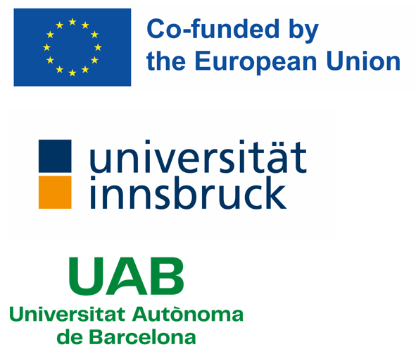

# About the Teaching With AI Project

**Teaching With AI (TAI)** is a project funded by the **Erasmus+ programme of the
European Union**. We develop teaching and learning material for secondary school
students and their teachers, both *about* artificial intelligence and *with* the
use of artificial intelligence.

## What we make

All material on this site is free to use and openly available. It is organised in
three parts:

- **Part 1: AI & Arts and Humanities** - how generative AI creates images, text
  and sound, and what that means for creative work.
- **Part 2: AI & Science** - in development, expected in the fall of 2026.
- **Part 3: AI & Everyday Life** - in development, expected in the spring of 2027.

Each part has a **student** section with the lesson materials and worksheets, and
a **teacher** section with supporting material, background and practical notes
for running the lessons.

## Using and sharing the material

The material is still under development and is being tested in classrooms, so it
will be updated regularly. Where we build on existing openly licensed work, the
source and licence are credited on the relevant page.

## Contact and partners

<!-- TODO: add the project partners, contact address and grant number here. -->

*Project partners and contact details will be added here.*

{ height="140" }

