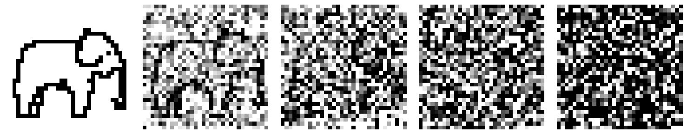
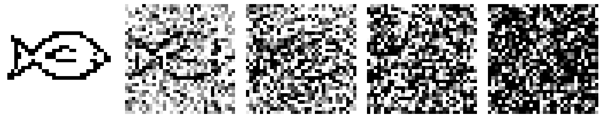
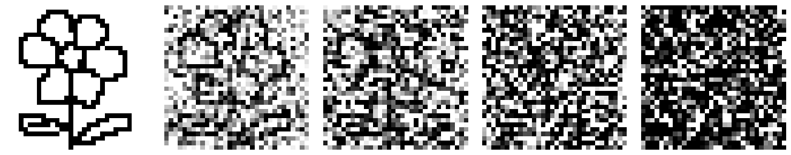
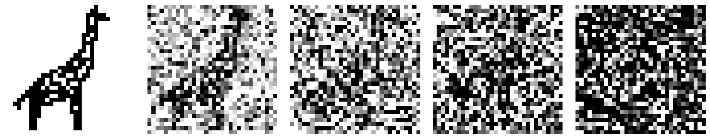
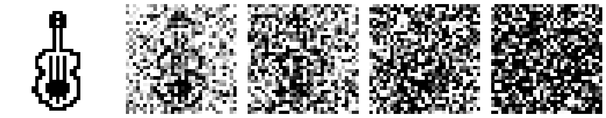
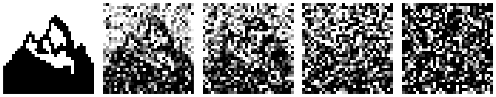
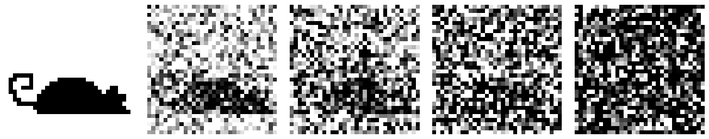
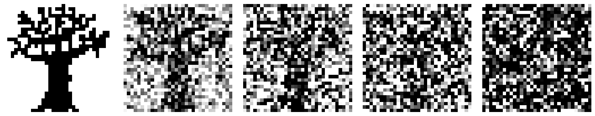
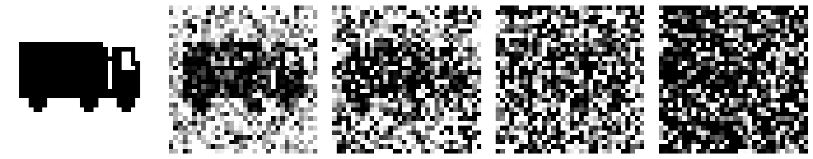

# Image to Noise Examples

Here you find the images and their transformation to noise. You can show these at
the end of Assignment 1, to compare with the images that the students created.
The idea is **not** that they recover this perfectly!

